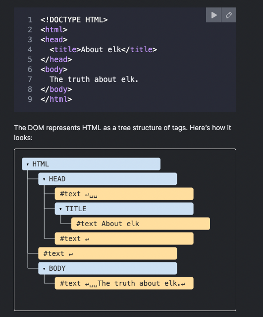

#  TABLE OF CONTENTS


#  1. [Introduction](#introduction)


## Introduction <a name="introduction"></a> [↩](#toc)
- In Javascript We can select elements by their id, class, tag name, or any other CSS selector.

### Selecting Elements <a name="selecting-elements-by-id"></a> [↩](#toc)
- We can select elements by their id, class, tag name, or any other CSS selector.
    - `document.querySelector('#id')`: returns the first element that matches the given CSS selector.
        - `#` is used to select by id ```#id```
        - `.` is used to select by class ```.class```

    - `document.querySelectorAll('#id')`: returns a list of elements that match the given CSS selector.

    - `document.getElementById('id')`: returns the element with the given id.

## What is the DOM? <a name="what-is-the-dom"></a> [↩](#toc)
- The DOM is a tree-like structure that represents the HTML of a webpage. It is created when the browser loads a page, and it can be modified with Javascript.

- 

    - Parent: The element that contains another element. 
        - Child: An element that is contained inside another element.
            - Content: The content of an element, not including the element's tag.
                - Tag: The name of an element, surrounded by angle brackets.
                    - Attribute: A property of an element, specified in the opening tag.


## Handling Events <a name="handling-events"></a> [↩](#toc)
- An event is an action that occurs on a webpage. Examples of events include clicking a button, resizing a window, or submitting a form.

- We can use Javascript to listen for events and trigger code when they occur.
    - You need to select the element you want to listen for events on.

    ```javascript
    const button = document.querySelector(.button);
    ```

    - You need to tell the browser which event you want to listen for.

    ```javascript
    button.addEventListener('click', function() {
        console.log('Button clicked');
    });
    ```

    - The first argument is the name of the event, and the second argument is the function that should be called when the event occurs.